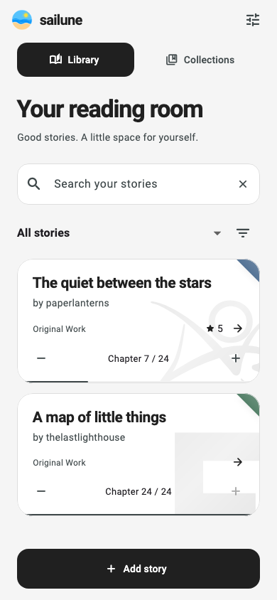
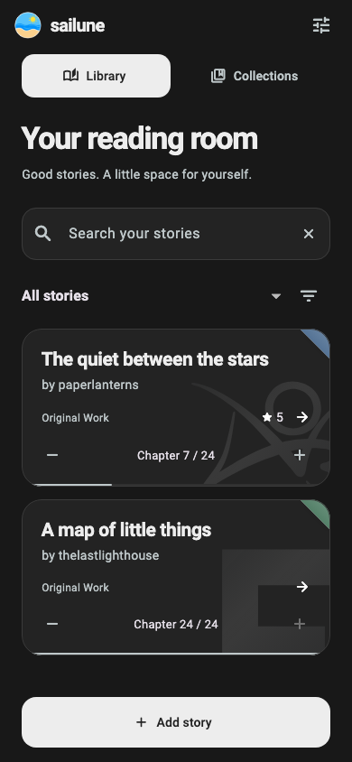

# Sailune for Android

A quiet reading room for your fanfiction bookmarks, built with **Flutter + Dart** and the **embedded Sailune-Go core**. Android is the focus of this repository; iOS will be a separate project.

The interface follows Sailune Desktop: monochrome surfaces, rounded story cards, generous touch targets, chapter controls, and light/dark appearance. The original Sailune icon is shared across clients. Cards use small, color-only folded corners (Completed green, Reading blue, To read lavender, On hold amber, Dropped rose). Site watermarks use low-opacity black in light mode and pearl in dark mode, clipped at the lower-right corner.

<p>


</p>

Screenshots contain synthetic test stories, not a preloaded collection.

## Features

- Add AO3 and FanFiction.net stories with public metadata, or save offline. The full-width add button expands into a rising form sheet.
- Scraping runs without popups. Inline progress offers Cancel and keeps a 15-second total deadline across HTTP and background WebView recovery. Cancelled or failed fetches retain the form.
- Search, shelves, website filtering, unread-chapter filtering, and sorting.
- Bounded SQL pages of 40 stories and lazy scrolling.
- Edit titles, authors, progress, personal tags, notes, and ratings.
- Refresh source details without replacing personal fields.
- Read the next chapter using the shared core's URL resolver. Opening never marks a chapter read.
- Confirm before deleting a bookmark.
- Export and merge the CLI/desktop versioned JSON backup format using Android's document picker.
- Device, light, and dark appearance; scalable text and 48dp controls.

The app starts with an empty library. Tests inject their own fixtures; the shipped app has no mock persistence or server dependency.

## Build

Requirements: Flutter **3.47.4** / Dart **3.13**, Go **1.26.3**, JDK **17**, Android SDK platform **36**, build tools **36.0.0**, NDK **28.2.13676358**. Android 7.0/API 24 or newer, ARM64 phones and x86_64 emulators. The current SQLite dependency is supported here on those 64-bit ABIs.

Keep the shared core alongside this checkout:

```text
Projects/
  sailune-cli/        # github.com/styxnanda/sailune-go
  sailune-mobile/    # this repository
```

The `core/go.mod` replacement points at `../../sailune-cli`. CI pins core commit `84f0017bc00fc36d2666193d81b7d8a611331a18`. Use that revision for reproducible builds. Local core changes are picked up deliberately when you rebuild the bindings.

```sh
# Set JAVA_HOME and ANDROID_HOME to your installed JDK and SDK.
sdkmanager 'platforms;android-36' 'build-tools;36.0.0' 'ndk;28.2.13676358'
go install golang.org/x/mobile/cmd/gomobile@v0.0.0-20260908204917-8b95e45f8d3e
go install golang.org/x/mobile/cmd/gobind@v0.0.0-20260908204917-8b95e45f8d3e
scripts/build-core.sh
flutter pub get
flutter run
# Installable development build:
flutter build apk --debug --target-platform android-arm64,android-x64
```

The APK is `build/app/outputs/flutter-apk/app-debug.apk`. The generated AAR is intentionally ignored by Git. Rebuild it after changes to the facade or Go core. Flutter generates its Gradle launcher and local configuration on first build.

CI runs analysis, widget/golden tests, Go race tests and vet, builds the APK, and runs the real bridge integration test on an Android emulator. The APK is a development artifact; production signing and Play Store release are not configured.

## Test

```sh
flutter analyze
flutter test
go -C core test -race ./...
go -C core vet ./...
# Only on a disposable emulator; creates and deletes a synthetic bookmark:
flutter test integration_test/library_test.dart -d emulator-5554
```

Golden screenshots are generated with bundled Roboto and Material Icons on macOS. Review visual changes before running `flutter test --update-goldens`.

See [verification notes](docs/verification.md) for results and remaining checks.

## Architecture and storage

```text
Flutter screens → Dart Library interface → Android MethodChannel
  → worker executor → gomobile AAR → Sailune-Go → private SQLite
```

Dart owns presentation and form state. The Kotlin adapter owns app-private paths, browser intents, preferences, and the document picker. Go owns validation, canonical URLs, duplicate checks, metadata, persistence, queries, chapter resolution, and transfers. No CLI subprocess is launched and no domain rules are copied into Dart.

SQLite and network work run off Android's UI thread. Search is debounced, outdated list responses are discarded, lists are paginated, and saves disable duplicate submission. Failed saves retain the form. Editing sends only changed personal fields.

The library lives under Android's private app files directory. It is plaintext within the app sandbox; uninstalling removes it. Android automatic backup is disabled. Export a snapshot before uninstalling. JSON backups contain your personal notes and reading history, and can be read by anyone who has the file. Mobile file transfers are capped at 16 MiB. Import merges atomically and skips duplicate URLs; it does not synchronize edits to existing bookmarks.

Visible website sign-in and authenticated fetching are available through Settings → Website sessions. Desktop-cookie import, full-story downloads, background update checks, and cloud sync are not implemented. Website restrictions, expired sessions, or browser-bound challenges can still prevent fetching; offline entry remains available.

## References

- [Flutter platform channels](https://docs.flutter.dev/platform-integration/platform-channels)
- [Go mobile bindings](https://go.dev/wiki/Mobile)
- [Flutter widget testing](https://docs.flutter.dev/cookbook/testing/widget/introduction)

Licensed under [GPL-3.0](LICENSE). Bundled Roboto uses the license in `assets/fonts/Roboto_LICENSE.txt`; Flutter and Go dependencies retain their respective licenses.

### Source recovery

The pinned shared core retries transient network failures and HTTP 525 with
bounded exponential backoff, up to four attempts. Android keeps its 15-second total deadline and cancellation button.
Login gates and browser challenges remain explicit failures; failed refreshes
preserve saved metadata. See the [measured reliability report](https://github.com/styxnanda/sailune-go/blob/84f0017bc00fc36d2666193d81b7d8a611331a18/docs/scraping-reliability.md).
The live sample improved AO3 recovery but did not reach 90% across both sites
because FFN continued to require browser challenges.

### Experimental silent FFN browser prototype

FFN HTTP fetches receive up to 5 seconds before browser recovery is considered
for a challenge, missing metadata, or an HTTP deadline. Android uses an on-demand,
unattached WebView for the remaining total 15-second budget. It runs JavaScript
and keeps app-private cookies/DOM storage; it never opens an external browser,
asks for verification, imports personal browser cookies, or solves interactive
challenges. Permission requests and JavaScript prompts are denied. Only the
story header is returned to Go, where origin, work identity, size and parsed
metadata are validated. A blocked attempt preserves existing data and displays
an inline error. Browser work is serialized and failures cool down for 60 seconds
within the running client; user cancellation does not trigger cooldown.

The WebView is destroyed on completion, cancellation, timeout, or Activity
shutdown. It has images disabled and no native JavaScript bridge. This limits
idle work but does not make browser rendering as cheap as HTTP. Emulators cannot
establish real-device FFN compatibility.

Native regression tests (with an emulator connected):

```sh
cd android
./gradlew :app:connectedDebugAndroidTest
```

The network-dependent `liveFFNSample` instrumentation test is skipped unless the
runner receives `-e liveFFN true`. It reports results rather than asserting an
unproven success target. This experimental integration is included in the pinned shared core. Further
FFN reliability work is on hold; no higher success rate is promised.

Local FFN test result: the direct Android WebView recovered 0/8 supplied stories
on the API 35 emulator; each blocked attempt ended at about 15 seconds. The
three deterministic native WebView tests passed, as did the Flutter/Go checks.
This is a working experimental integration, not a demonstrated FFN reliability
fix. Physical-device behavior remains unverified.

### Add-story motion

The high-contrast Add story button fades into the theme's canvas color while its
background expands. The sheet then rises over the matching surface, and the
expansion layer fades away. The form keeps its normal light/dark palette; reduced
motion skips the transition. Light and dark visual tests cover expansion and rise.

### Website sessions on Android

Open Settings → Website sessions → Archive of Our Own or FanFiction.net. Confirm
the consent sheet, then sign in on the official website. A Sailune-styled browser
frame closes automatically after detecting signed-in account navigation and a
stored cookie. Closing manually never reports success. “Sign-in saved” records
the last successful check, not a guarantee against future expiry. Retry Add or
Refresh after signing in. Expired sessions direct you back to Settings.

FFN starts at its mobile login route, `https://m.fanfiction.net/m/login.php`.
A login-page HTTP 404 or a rendered “404 / File Not Found” page triggers one
retry of the desktop login route in desktop browser mode. It does not retry
after a password form has been shown, repeat submissions, clear cookies, or
treat errors as signed-in state. Direct live probes may still be blocked by
FFN; automated recovery tests use controlled pages.

The visible FFN sign-in window accepts third-party cookies for embedded
verification frames. AO3 and the hidden fetch browser keep third-party cookies
disabled. A completed CAPTCHA or verification cookie is not proof of login;
the account navigation check still has to succeed. This addresses a browser
compatibility restriction, not a verified cure for FFN's live login failures.

The check reads only navigation (AO3's header greeting/logout; FFN's
account/logout links or its mobile profile and account/logout dropdown), never
password fields or values. FFN's `/m/acct.php` dropdown structure was verified
against a real signed-in account; automated fixtures use synthetic identities.
Cookie presence,
page load, and redirects alone do not count. Detection is conservative and may
need updating if a website changes; unrecognized pages remain open with Close
available. Checks are local, bounded to two minutes per page, and released on
close. The scrape timeout does not limit sign-in time.

Story reading uses the default browser's Custom Tabs UI where supported, falling
back to opening the browser. Login retains app-owned WebView storage because
Custom Tabs cannot expose browser cookies to the scraper. Browser and app
sessions are separate; no session is transferred to a desktop CLI.

Android CookieManager owns app-private cookie persistence and enforces cookie
path/domain matching, including HttpOnly cookies. The native/Go transport reuses
cookies for supported HTTPS sites and stores allowed Set-Cookie rotations.
Cookies and passwords are never sent over the Flutter channel, written into the
bookmark database, included in library exports, or logged. Password entry stays
in the site's WebView; no JavaScript bridge is attached to the login page.
Android automatic backups are disabled. This uses Android's WebView storage,
not an additional custom Keystore-encrypted cookie export.

Sign-in is restricted to the chosen website's HTTPS hosts, and TLS errors are
never bypassed. External identity providers (such as Google sign-in) are not
supported by this embedded flow. Website sessions cannot be changed while a
library request is running, and fetching cannot start while sign-in is open.
Clear website sessions removes all AO3/FFN cookies, website storage and WebView
cache, without deleting bookmarks or already-saved metadata.

Tests use synthetic sessions: authenticated metadata add, expiration/revocation,
cookie rotation, cross-site redirect blocking, cookie-free backups, native cookie
scope/persistence/clearing, and opening/closing the visible sign-in dialog. A real
account login and restricted live work must still be verified by the account
owner; no personal credentials are used by the automated tests.

### First-launch tour

A four-page, swipeable welcome tour points to Add story, Appearance, Website
sessions, and library export/import. Focused screenshot cutouts show only the relevant controls and follow the active light/dark
theme. Back/Next, Skip, reduced motion, and large text are supported. Finishing
or skipping stores an Android preference; clearing app data resets it. Existing
installations see the tour once after upgrading. Replay it in Settings at any
time. The tour never opens a website or grants session consent.

Regenerate the bundled screenshots from the actual Flutter screens with:
`flutter test --update-goldens tool/onboarding_screenshots.dart`.
Only synthetic/empty library data is used.

### App presentation

Confirmation sheets and transient notices share Sailune's surface, typography,
and rounded controls. Startup uses a static centered icon and app name while
preferences load, with no travel animation or artificial delay. Grouped settings
cards clip their pressed highlights to the rounded outline.

### Library card shortcuts

Tap the chapter count to reveal Open and Copy link. These resolve the displayed
chapter (chapter 0 resolves to chapter 1) without updating progress. Tap outside
to collapse them. Long-press a card to confirm deletion.

Swipe the folded status corner right/down to advance, or left/up to reverse:
To read → Reading → Completed → On hold → Dropped. Only the fold twists;
short/cancelled drags do not save. Failed writes keep the prior status. Screen
readers can use the fold's increase/decrease actions, and reduced motion disables
the twist. Active shelf filters are respected when status changes.


## v0.9.0 — collections and artwork

See [release and upgrade notes](docs/release-v0.9.0.md). Create manual collections
or automatic tag-based collections through **Manage collections** in the library.
Each story can have a portrait cover and a separate horizontal background.
Settings provides portrait, background, and hidden library appearances plus an
independent detail-artwork toggle. Default cards remain minimal.

Complete ZIP backups include collections and images. Importing preserves existing
personal data and images, fills missing artwork slots, and adds memberships.
Legacy JSON backups remain importable. Back up before the schema-2 upgrade;
older binaries cannot open the migrated library. Cloud sync is not included.

## Android 0.9.5

Collections now have a top-level tab, appearance-aware preview cards, and the
same story browsing and filters as Library. Story detail artwork fills the
viewport width. See [release notes](docs/release-v0.9.5.md). The shared Go core
remains at v0.9.0; no database migration is needed for this interface update.
