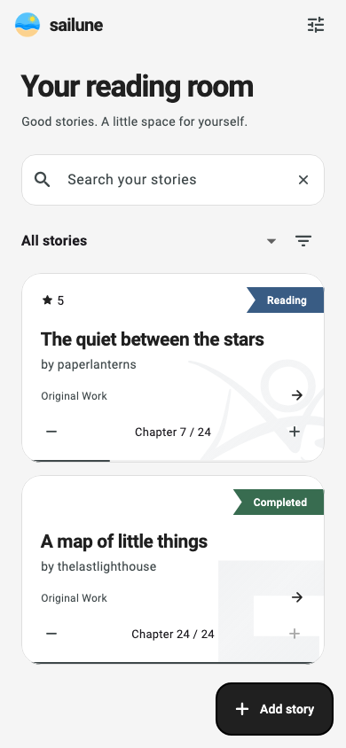
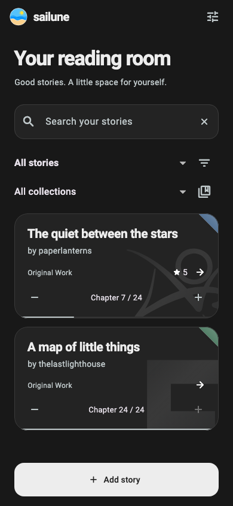

<p align="center">
  
</p>
<h1 align="center">sailune</h1>
<p align="center">A quiet home for your fanfiction bookmarks, on Android.</p>
<p align="center">
  <a href="https://github.com/styxnanda/sailune-mobile/releases/latest">Download</a> ·
  <a href="#getting-started">Getting started</a> ·
  <a href="#contributing">Contributing</a> ·
  <a href="LICENSE">GPL-3.0</a>
</p>

Sailune helps you keep track of the stories you love on **Archive of Our Own** and
**FanFiction.net**. Save bookmarks, track your reading progress, organize collections,
and keep your own notes and ratings in a library stored on your device.

Sailune is a bookmark manager: stories open in your browser, and you decide when
to update your progress. It does not download full stories or synchronize your
library through a cloud service.

<p align="center">
  
  
</p>
<p align="center"><sub>Example library with fictional test data. Your library starts empty.</sub></p>

## What you can do

- **Build your library.** Paste an AO3 or FFN link to fetch story details, or enter
  the title and author yourself without fetching.
- **Track your reading.** Keep a chapter number and reading status for each story.
  Open the next chapter without automatically marking it as read.
- **Make it personal.** Add tags, notes, ratings, covers, and background artwork.
- **Organize collections.** Choose stories manually or create automatic collections
  using tags and other matching rules. Swipe between Library and Collections.
- **Find your next read.** Search, sort, and filter by shelf, website, or unread chapters.
- **Choose your appearance.** Use light, dark, or device theme, with minimal,
  portrait-cover, or background-artwork cards.
- **Keep a backup.** Export stories, collections, and artwork in a ZIP, then import
  it later. Legacy Sailune JSON backups can also be imported.

## Install

Download the Android APK from [GitHub Releases](https://github.com/styxnanda/sailune-mobile/releases/latest)
and open it on your device. Android may ask you to allow installation from the
browser or file manager you are using.

Sailune supports **Android 7.0 or newer**, on **ARM64** devices and **x86_64**
emulators. This repository contains the Android app, built with Flutter and the
shared [Sailune-Go core](https://github.com/styxnanda/sailune-go).

Release APKs currently use development signing. If Android rejects an update
because its signing key differs, export and verify a backup before uninstalling
the existing app. Uninstalling removes its local library.

## Getting started

1. Tap **Add story** in Library and paste a supported story link.
2. Leave **Fetch website details** enabled to fill details automatically, or turn
   it off to enter a title and author yourself.
3. Save the story, then open it to update your progress, notes, tags, or rating.
4. Open **Collections** to create a manual collection or one based on matching rules.
5. In **Settings**, choose your appearance and use **Save a backup** regularly.

For website access, go to **Settings → Website sessions** and sign in to the site.
Signing in improves fetching reliability; **FFN fetching requires a saved sign-in
session**. Website restrictions or expired sessions can still prevent fetching.
Manual entry remains available, and failed fetches keep your entered details.

Tap a story's chapter count to open that chapter or copy its link. Swipe the
folded corner of a story card to change its reading status. Long-press a card
to remove the bookmark. The welcome tour can be replayed from Settings.

## Your data

Your library is stored in the app's private SQLite database on your device.
There is no Sailune account or cloud synchronization. Reading and fetching story
details contact the relevant website.

Website sessions are stored separately from your bookmarks and are excluded from
library backups. **Clear website sessions** signs you out without deleting stories.
App sign-in and your browser's sign-in are separate.

Android automatic backup is disabled. Keep an exported backup before clearing app
data or uninstalling. Backup files include your notes and reading history, so
store them somewhere you trust. Import merges into your library, preserving
existing personal data and artwork while adding missing stories, artwork, and
collection memberships.

## Contributing

Bug reports, usability feedback, documentation improvements, and code contributions
are welcome. Use [Issues](https://github.com/styxnanda/sailune-mobile/issues) to
report a problem or discuss a larger change before starting work.

For a bug report, include your app version, Android version, steps to reproduce,
and what you expected to happen. Screenshots or a minimal example help; remove
personal notes, session information, and other private data before sharing them.

For a code contribution:

1. Fork the repository and create a branch for your change.
2. Set up the app using the instructions below.
3. Keep the change focused and add or update tests for affected behavior.
4. Run the checks and open a pull request explaining the problem, the change,
   and how you verified it. Include screenshots for visible UI changes.

### Development setup

Use the versions pinned in [CI](.github/workflows/android.yml):

| Tool | Version |
| --- | --- |
| Flutter / Dart | 3.47.4 / 3.13 |
| Go | 1.26.3 |
| JDK | 17 |
| Android SDK platform | 36 |
| Android build tools | 36.0.0 |
| Android NDK | 28.2.13676358 |

Clone the shared core beside this repository. The directory name `sailune-cli`
is required by the local replacement in [core/go.mod](core/go.mod).

```sh
git clone --branch v0.9.0 https://github.com/styxnanda/sailune-go.git sailune-cli
git clone https://github.com/styxnanda/sailune-mobile.git sailune-mobile
cd sailune-mobile
```

Set `JAVA_HOME` and `ANDROID_HOME` to your installed JDK and Android SDK, and
make the SDK command-line tools and platform tools available on your `PATH`.
Then build the Go bindings and launch the app on a connected device or emulator:

```sh
sdkmanager 'platforms;android-36' 'build-tools;36.0.0' 'ndk;28.2.13676358'
go install golang.org/x/mobile/cmd/gomobile@v0.0.0-20260908204917-8b95e45f8d3e
go install golang.org/x/mobile/cmd/gobind@v0.0.0-20260908204917-8b95e45f8d3e
scripts/build-core.sh
flutter pub get
flutter run
```

Rebuild the bindings after changing the Go core or mobile bridge. The generated
`android/app/libs/sailune.aar` is intentionally excluded from Git.

To create an APK:

```sh
scripts/build-release.sh
```

The APK and checksum are written to `build/releases/`.

### Checks

```sh
dart format --output=none --set-exit-if-changed lib test integration_test test_driver
flutter analyze
flutter test
go -C core test -race ./...
go -C core vet ./...
```

Run the Android bridge integration test on a disposable emulator with the device
ID `emulator-5554`; it creates and removes synthetic library data:

```sh
bash scripts/test-android-integration.sh
```

For changes to the native Android implementation, also run its instrumentation tests
with an emulator connected:

```sh
cd android
./gradlew :app:connectedDebugAndroidTest
```

Visual tests use bundled fonts and macOS-generated reference images. When a UI
change is intentional, regenerate the affected snapshots with
`flutter test --update-goldens` and inspect them before committing.

### Where the code lives

| Location | Responsibility |
| --- | --- |
| `lib/screens/`, `lib/widgets/` | Flutter screens, controls, and presentation |
| `lib/data/`, `lib/models/` | Dart library interface and story models |
| `android/app/src/` | Android bridge, website sessions, and device integration |
| `core/mobile/` | Go facade exposed through mobile bindings |
| `test/`, `integration_test/` | Widget, visual, and Android bridge tests |
| `scripts/` | Build and validation helpers |

Flutter handles the interface, Kotlin connects it to Android, and Sailune-Go
owns validation, metadata, database queries, and backup operations. Changes to
shared story behavior generally belong in the
[Sailune-Go repository](https://github.com/styxnanda/sailune-go).

## License

Sailune is licensed under [GPL-3.0](LICENSE). Bundled Roboto fonts use the
[Apache 2.0 license](assets/fonts/Roboto_LICENSE.txt). Other dependencies retain
their respective licenses.
